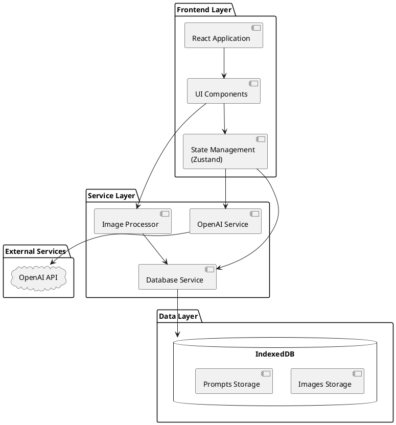
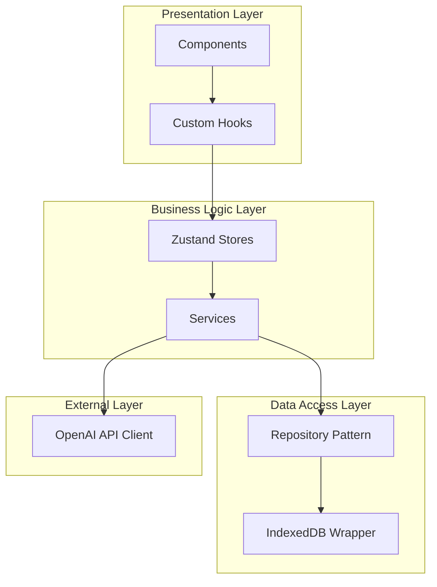
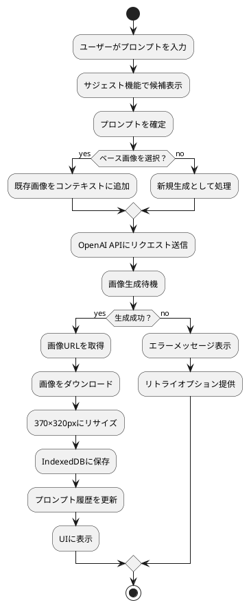
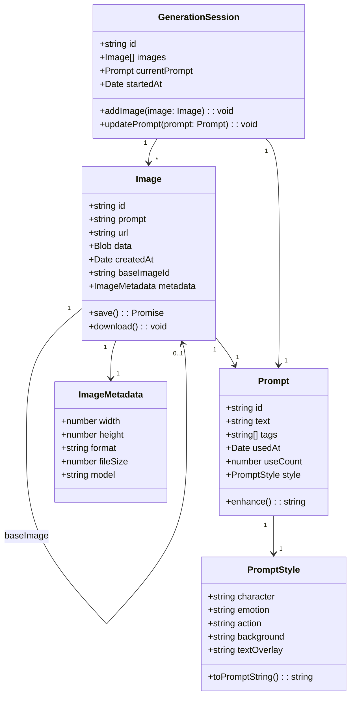
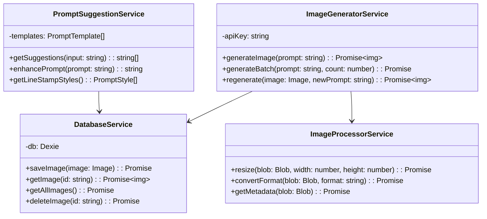
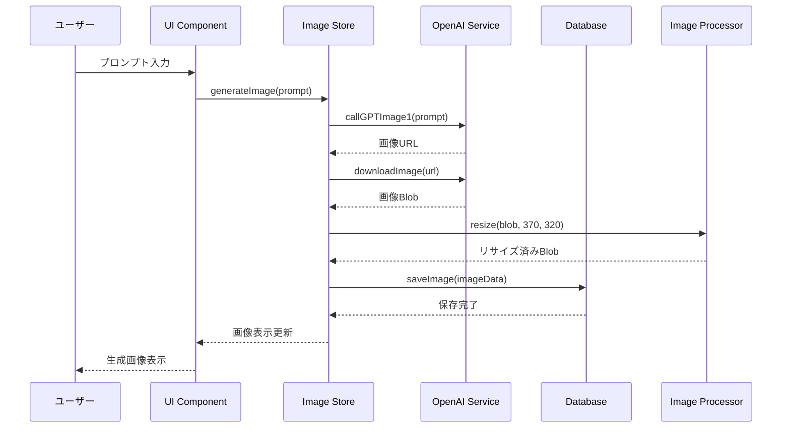
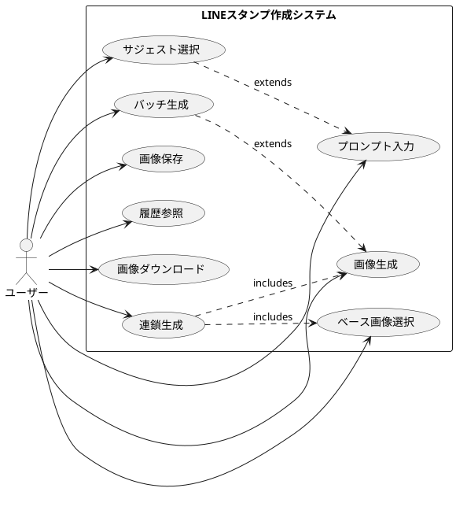
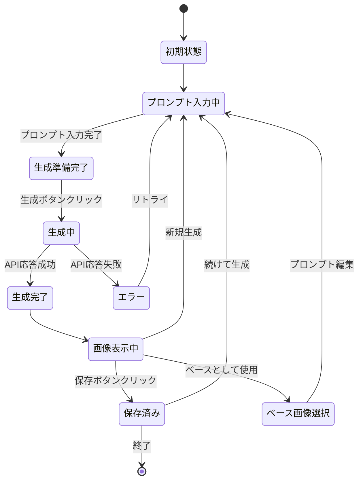

# LINEスタンプ作成アプリケーション 詳細設計書

## 1. プロジェクト概要

### 1.1 プロジェクト基本情報

```yaml
project:
  name: "LINE Stamp Creator"
  version: "1.0.0"
  description: "OpenAI GPT-Image-1 APIを使用してLINEスタンプを簡単に作成できるReactアプリケーション"
  type: "Web Application"
  target_users: "個人開発者向け（ローカル環境での使用）"
```

### 1.2 主要機能

```yaml
features:
  core:
    - 画像生成: "OpenAI GPT-Image-1 APIを使用した画像生成"
    - プロンプト支援: "LINEスタンプ向けプロンプトのサジェスト機能"
    - 画像管理: "生成画像のIndexedDB保存と履歴管理"
    - 連鎖生成: "既存画像をベースにした新規画像生成"
    - バッチ生成: "同一プロンプトでの複数バリエーション生成"
  
  requirements:
    functional:
      - "1枚ずつの画像生成と管理"
      - "プロンプト履歴の保存と再利用"
      - "生成画像のダウンロード機能"
      - "画像サイズの自動調整（370×320px）"
    
    non_functional:
      - "レスポンス時間: 画像生成3分以内"
      - "データ永続性: ブラウザIndexedDBによる保存"
      - "セキュリティ: APIキーの環境変数管理"
```

## 2. 技術スタック概要

### 2.1 技術選定

```yaml
technology_stack:
  frontend:
    framework: "React 18"
    build_tool: "Vite"
    language: "TypeScript"
    styling: "TailwindCSS"
    state_management: "Zustand"
    
  api_integration:
    openai_api: "OpenAI API (GPT-Image-1 / gpt-image-1)"
    http_client: "Axios"
    
  data_storage:
    primary: "IndexedDB (Dexie.js)"
    temporary: "React State"
    
  utilities:
    image_processing: "Canvas API"
    date_handling: "date-fns"
    uuid_generation: "uuid"
    
  development:
    package_manager: "Bun"
    linter: "ESLint"
    formatter: "Prettier"
```

### 2.2 選定理由

```yaml
selection_reasons:
  React:
    - "コンポーネントベースの開発で機能の分離が容易"
    - "豊富なエコシステムと開発者の経験"
    
  Vite:
    - "高速な開発サーバーとHMR"
    - "環境変数の簡単な管理（.env.local）"
    - "Bunとの相性が良い"
    
  TypeScript:
    - "型安全性による開発効率の向上"
    - "APIレスポンスの型定義による保守性向上"
    
  TailwindCSS:
    - "シンプルなUI構築に最適"
    - "開発者の技術スタックに含まれている"
    
  Zustand:
    - "シンプルな状態管理"
    - "TypeScriptとの相性が良い"
    
  Bun:
    - "npmより高速なパッケージインストール"
    - "軽量で高速な実行環境"
    - "Node.js互換性を保ちながら高パフォーマンス"
    
  GPT_Image_1:
    - "安定した画像生成品質"
    - "プロンプトへの忠実な応答"
    - "コスト効率が良い"
    
  IndexedDB_Dexie:
    - "大容量画像データの保存に適している"
    - "Dexie.jsによる簡潔なAPI"
```

## 3. ディレクトリ構造

```tree
line-stamp-creator/
├── src/
│   ├── components/
│   │   ├── ImageGenerator/
│   │   │   ├── ImageGenerator.tsx
│   │   │   ├── PromptInput.tsx
│   │   │   ├── SuggestionList.tsx
│   │   │   └── GenerateButton.tsx
│   │   ├── ImageViewer/
│   │   │   ├── ImageViewer.tsx
│   │   │   ├── ImageCard.tsx
│   │   │   └── DownloadButton.tsx
│   │   ├── History/
│   │   │   ├── HistoryPanel.tsx
│   │   │   ├── HistoryItem.tsx
│   │   │   └── PromptHistory.tsx
│   │   └── Layout/
│   │       ├── Header.tsx
│   │       ├── MainLayout.tsx
│   │       └── Sidebar.tsx
│   │
│   ├── services/
│   │   ├── openai/
│   │   │   ├── imageGenerator.ts
│   │   │   └── promptEnhancer.ts
│   │   ├── database/
│   │   │   ├── db.ts
│   │   │   ├── imageRepository.ts
│   │   │   └── promptRepository.ts
│   │   └── utils/
│   │       ├── imageProcessor.ts
│   │       └── constants.ts
│   │
│   ├── stores/
│   │   ├── imageStore.ts
│   │   ├── promptStore.ts
│   │   └── uiStore.ts
│   │
│   ├── types/
│   │   ├── image.types.ts
│   │   ├── prompt.types.ts
│   │   └── api.types.ts
│   │
│   ├── hooks/
│   │   ├── useImageGeneration.ts
│   │   ├── usePromptSuggestions.ts
│   │   └── useDatabase.ts
│   │
│   ├── App.tsx
│   ├── main.tsx
│   └── index.css
│
├── public/
│   └── assets/
│       └── templates/
│
├── tests/
│   ├── unit/
│   │   ├── services/
│   │   └── components/
│   └── integration/
│       └── workflows/
│
├── docs/
│   ├── API.md
│   ├── DATABASE.md
│   └── USER_GUIDE.md
│
├── .env.local
├── .gitignore
├── package.json
├── bun.lockb
├── tsconfig.json
├── vite.config.ts
├── tailwind.config.js
└── README.md
```

## 4. UMLによるシステムアーキテクチャ

### 4.1 コンポーネント図



### 4.2 パッケージ図



## 5. UMLによるデータフロー

### 5.1 画像生成フロー（アクティビティ図）



## 6. UMLクラス図

### 6.1 主要エンティティ



### 6.2 サービスクラス



## 7. 動的振る舞い（シーケンス図）

### 7.1 画像生成シーケンス



### 7.2 ユースケース図



## 8. データベース設計

### 8.1 IndexedDB スキーマ

```yaml
database:
  name: "LineStampCreatorDB"
  version: 1
  stores:
    images:
      keyPath: "id"
      indexes:
        - name: "createdAt"
          unique: false
        - name: "prompt"
          unique: false
        - name: "baseImageId"
          unique: false
      schema:
        id: "string (UUID)"
        prompt: "string"
        enhancedPrompt: "string"
        imageBlob: "Blob"
        thumbnailBlob: "Blob"
        createdAt: "Date"
        baseImageId: "string | null"
        metadata:
          width: "number"
          height: "number"
          format: "string"
          fileSize: "number"
          model: "string (gpt-image-1)"
    
    prompts:
      keyPath: "id"
      indexes:
        - name: "usedAt"
          unique: false
        - name: "useCount"
          unique: false
      schema:
        id: "string (UUID)"
        text: "string"
        tags: "string[]"
        style:
          character: "string"
          emotion: "string"
          action: "string"
          background: "string"
        usedAt: "Date"
        useCount: "number"
        
    sessions:
      keyPath: "id"
      indexes:
        - name: "startedAt"
          unique: false
      schema:
        id: "string (UUID)"
        imageIds: "string[]"
        currentPromptId: "string"
        startedAt: "Date"
        lastModified: "Date"
```

## 9. API設計

### 9.1 OpenAI API統合

```yaml
api:
  endpoint: "https://api.openai.com/v1/images/generations"
  method: "POST"
  headers:
    Authorization: "Bearer ${OPENAI_API_KEY}"
    Content-Type: "application/json"
  
  request:
    model: "gpt-image-1"
    prompt: "string (enhanced prompt)"
    n: 1
    size: "1024x1024"
    quality: "standard"
    response_format: "url"
  
  response:
    created: "timestamp"
    data:
      - url: "string"
        revised_prompt: "string"
  
  error_handling:
    rate_limit:
      strategy: "exponential_backoff"
      max_retries: 3
      initial_delay: 1000
    
    invalid_request:
      action: "show_error_message"
      fallback: "suggest_prompt_modification"
```

### 9.2 内部API設計

```typescript
interface ImageGeneratorAPI {
  generateSingle(prompt: string, options?: GenerationOptions): Promise<GeneratedImage>;
  generateBatch(prompt: string, count: number): Promise<GeneratedImage[]>;
  regenerateFromBase(baseImageId: string, newPrompt: string): Promise<GeneratedImage>;
}

interface DatabaseAPI {
  images: {
    create(image: ImageData): Promise<string>;
    read(id: string): Promise<ImageData | null>;
    update(id: string, data: Partial<ImageData>): Promise<void>;
    delete(id: string): Promise<void>;
    list(filter?: ImageFilter): Promise<ImageData[]>;
  };
  prompts: {
    create(prompt: PromptData): Promise<string>;
    list(limit?: number): Promise<PromptData[]>;
    incrementUsage(id: string): Promise<void>;
  };
}
```

## 10. UI/UXフロー設計

### 10.1 画面レイアウト構造

```yaml
layout:
  structure: "single-page-application"
  
  sections:
    header:
      height: "64px"
      components:
        - logo: "LINEスタンプクリエイター"
        - status: "API接続状態"
    
    main_area:
      layout: "2-column"
      
      left_panel:
        width: "40%"
        components:
          prompt_section:
            - prompt_input: "テキストエリア"
            - suggestion_chips: "クリック可能なタグ"
            - style_selector: "スタイル選択ドロップダウン"
          
          generation_controls:
            - generate_button: "生成ボタン"
            - batch_count: "バッチ数選択"
            - base_image_selector: "ベース画像選択"
      
      right_panel:
        width: "60%"
        components:
          image_viewer:
            - current_image: "生成された画像表示"
            - image_info: "メタデータ表示"
            - action_buttons:
                - download: "ダウンロード"
                - save: "保存"
                - use_as_base: "ベースとして使用"
    
    sidebar:
      position: "right"
      width: "300px"
      collapsible: true
      components:
        - image_history: "生成履歴"
        - prompt_history: "プロンプト履歴"
```

### 10.2 状態遷移図



## 11. テスト戦略と項目

### 11.1 テスト戦略

```yaml
test_strategy:
  pyramid:
    unit_tests: "70%"
    integration_tests: "20%"
    e2e_tests: "10%"
  
  coverage_target: "80%"
  
  automation:
    ci_cd: "GitHub Actions"
    test_runner: "Bun test"
    e2e_framework: "Playwright"
```

### 11.2 テスト項目

#### 単体テスト

```yaml
unit_tests:
  services:
    image_generator:
      - "プロンプトの検証"
      - "APIリクエストの構築"
      - "レスポンスのパース"
      - "エラーハンドリング"
    
    database:
      - "画像の保存"
      - "画像の取得"
      - "履歴の管理"
      - "インデックスの動作"
    
    prompt_enhancer:
      - "サジェスト生成"
      - "プロンプト拡張"
      - "スタイル適用"
  
  components:
    prompt_input:
      - "入力検証"
      - "サジェスト表示"
      - "文字数制限"
    
    image_viewer:
      - "画像表示"
      - "メタデータ表示"
      - "ダウンロード機能"
```

#### 統合テスト

```yaml
integration_tests:
  workflows:
    image_generation_flow:
      - "プロンプト入力から画像生成まで"
      - "生成画像の保存"
      - "履歴からの再生成"
    
    batch_generation:
      - "複数画像の同時生成"
      - "エラー時の部分成功処理"
    
    data_persistence:
      - "IndexedDBへの保存と読み込み"
      - "セッション管理"
```

#### E2Eテスト

```yaml
e2e_tests:
  critical_paths:
    - "初回起動から画像生成完了まで"
    - "履歴から画像を選択して連鎖生成"
    - "バッチ生成とダウンロード"
  
  browser_compatibility:
    - "Chrome最新版"
    - "Firefox最新版"
    - "Safari最新版"
```

## 12. 非機能要件への対応

### 12.1 パフォーマンス

```yaml
performance:
  requirements:
    image_generation: "3分以内"
    ui_response: "100ms以内"
    database_query: "500ms以内"
  
  optimizations:
    lazy_loading: "画像の遅延読み込み"
    virtual_scrolling: "履歴リストの仮想スクロール"
    image_compression: "サムネイル生成"
    indexeddb_indexes: "適切なインデックス設計"
```

### 12.2 セキュリティ

```yaml
security:
  api_key_management:
    storage: "環境変数（.env.local）"
    access: "サーバーサイドのみ（Viteプロキシ利用）"
    rotation: "定期的な更新推奨"
  
  data_protection:
    storage: "ブラウザローカル（IndexedDB）"
    transmission: "HTTPS必須"
    validation: "入力値のサニタイズ"
```

### 12.3 保守性

```yaml
maintainability:
  code_quality:
    linting: "ESLint設定"
    formatting: "Prettier自動フォーマット"
    type_safety: "TypeScript strict mode"
  
  documentation:
    code_comments: "JSDoc形式"
    api_docs: "OpenAPI仕様"
    user_guide: "Markdown形式"
  
  monitoring:
    error_tracking: "console.errorのラップ"
    usage_analytics: "生成回数のカウント"
```

## 13. 実装上の注意点

### 13.1 技術的制約

```yaml
technical_constraints:
  openai_api:
    model: "gpt-image-1"
    rate_limits:
      - "画像生成: 50回/分"
      - "同時リクエスト: 5並列まで"
    
    image_constraints:
      - "最大サイズ: 1024x1024"
      - "フォーマット: PNG/JPEG"
      - "生成時間: 最大3分"
  
  browser:
    indexeddb_limit: "ブラウザによる（通常50MB以上）"
    cors: "OpenAI APIへの直接アクセス不可"
```

### 13.2 実装優先順位

```yaml
implementation_priority:
  phase1:
    - "基本的な画像生成機能"
    - "プロンプト入力UI"
    - "画像表示"
  
  phase2:
    - "IndexedDB統合"
    - "履歴機能"
    - "サジェスト機能"
  
  phase3:
    - "バッチ生成"
    - "連鎖生成"
    - "プロンプト拡張"
```

### 13.3 エラーハンドリング

```yaml
error_handling:
  api_errors:
    rate_limit:
      message: "生成制限に達しました。少し待ってから再試行してください。"
      action: "リトライボタン表示"
    
    timeout:
      message: "画像生成がタイムアウトしました（3分経過）。再試行してください。"
      action: "再生成ボタン表示"
    
    invalid_prompt:
      message: "プロンプトに問題があります。内容を確認してください。"
      action: "プロンプト修正提案"
    
    network_error:
      message: "ネットワークエラーが発生しました。"
      action: "オフライン機能への切り替え"
  
  storage_errors:
    quota_exceeded:
      message: "ストレージ容量が不足しています。"
      action: "古い画像の削除提案"
```

## 14. 付録

### 14.1 用語集

```yaml
glossary:
  GPT-Image-1: "OpenAIの画像生成AI（gpt-image-1モデル）"
  IndexedDB: "ブラウザの大容量ローカルストレージ"
  プロンプト: "画像生成のための指示文"
  バッチ生成: "同一プロンプトで複数画像を生成"
  連鎖生成: "既存画像を基に新規画像を生成"
  Bun: "高速なJavaScriptランタイム・パッケージマネージャー"
```

### 14.2 参考資料

```yaml
references:
  openai:
    - "https://platform.openai.com/docs/guides/images"
    - "https://platform.openai.com/docs/api-reference/images"
    - "https://platform.openai.com/docs/guides/tools-image-generation"
  
  line_stamp:
    - "LINEクリエイターズマーケット制作ガイドライン"
    - "スタンプ画像の仕様（370×320px）"
  
  technologies:
    - "React 18 Documentation"
    - "Vite Configuration Guide"
    - "Bun Documentation (https://bun.sh/docs)"
    - "IndexedDB API Reference"
    - "Dexie.js Documentation"
```

### 14.3 プロンプトテンプレート例

```yaml
prompt_templates:
  base_structure:
    template: "[キャラクター] が [感情/状態] で [アクション] している、[スタイル] のLINEスタンプイラスト"
  
  style_keywords:
    character_types:
      - "シンプルな線画の"
      - "2頭身の"
      - "丸みを帯びた"
      - "ゆるキャラ風の"
    
    emotions:
      - "嬉しそうに"
      - "困った様子で"
      - "驚いて"
      - "照れながら"
    
    actions:
      - "手を振っている"
      - "お辞儀している"
      - "ジャンプしている"
      - "考え込んでいる"
    
    visual_styles:
      - "パステルカラー"
      - "太い輪郭線"
      - "背景透過"
      - "手書き風"
  
  line_specific:
    requirements:
      - "small smartphone screen friendly"
      - "clear emotion expression"
      - "simple and bold design"
      - "370x320 pixel optimized"
      - "optimized for gpt-image-1 model"
```

## 15. 開発ロードマップ

```yaml
roadmap:
  week1:
    tasks:
      - "プロジェクトセットアップ"
      - "基本UI実装"
      - "OpenAI API統合"
    deliverables:
      - "画像生成機能（MVP）"
  
  week2:
    tasks:
      - "IndexedDB統合"
      - "履歴機能実装"
      - "プロンプトサジェスト"
    deliverables:
      - "データ永続化機能"
  
  week3:
    tasks:
      - "バッチ生成機能"
      - "連鎖生成機能"
      - "UI改善"
    deliverables:
      - "完全機能版"
  
  week4:
    tasks:
      - "テスト実装"
      - "バグ修正"
      - "ドキュメント作成"
    deliverables:
      - "リリース版"
```