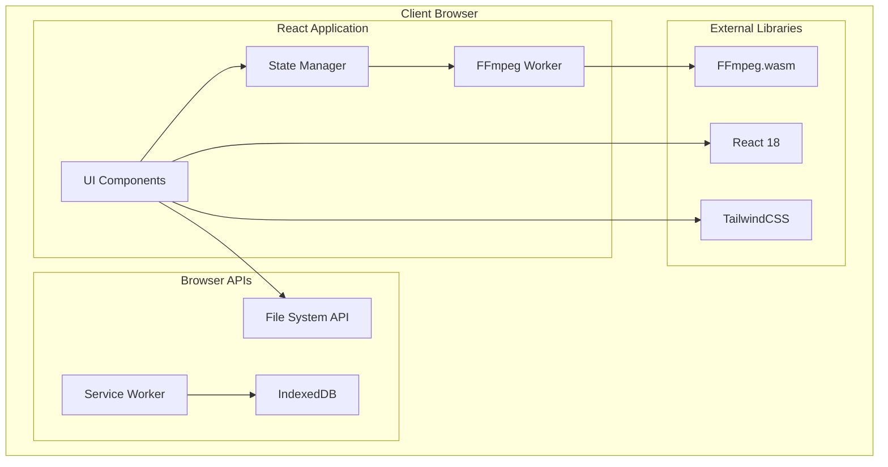
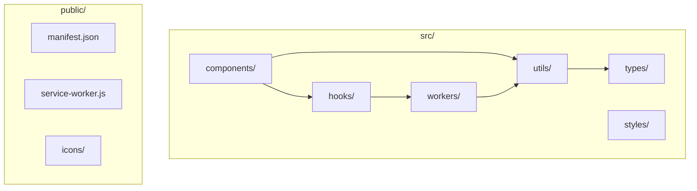
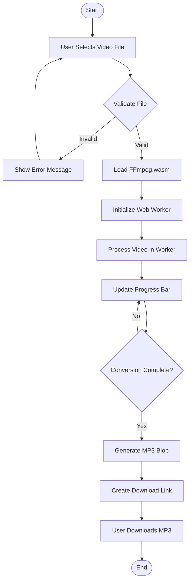
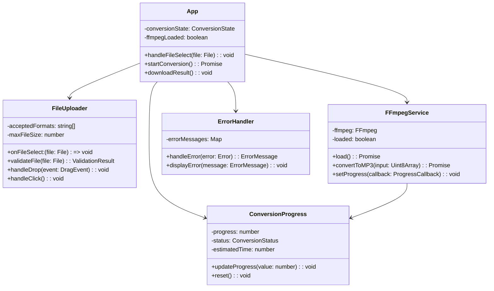
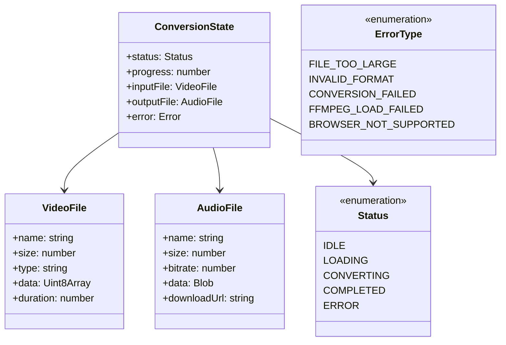
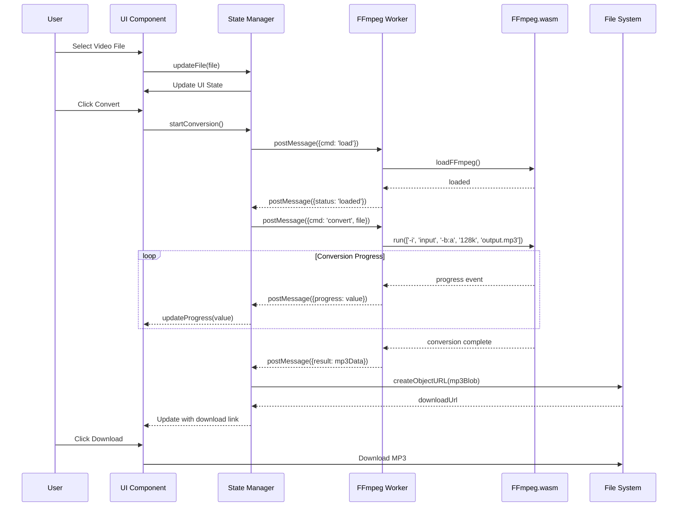
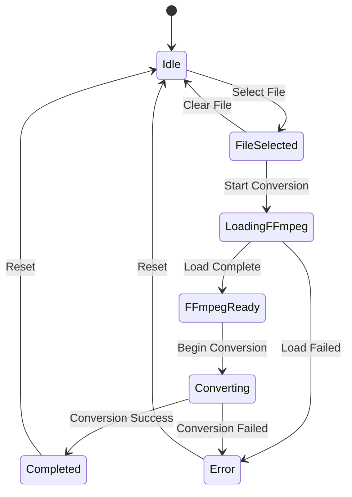
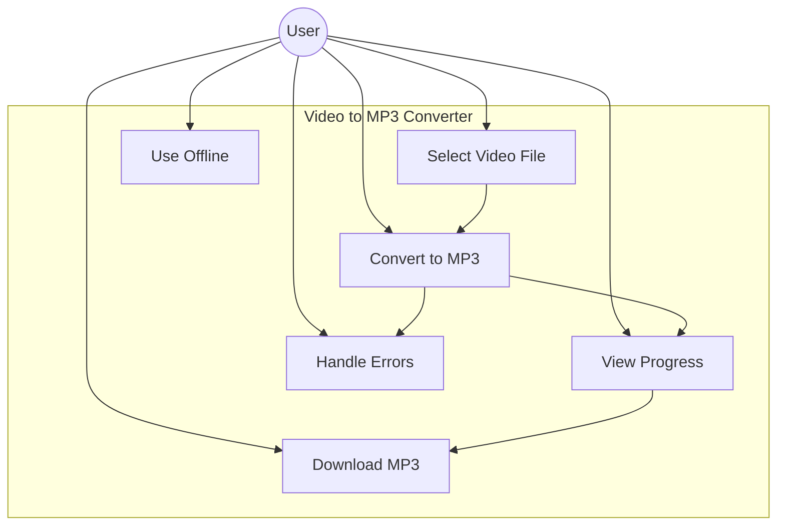
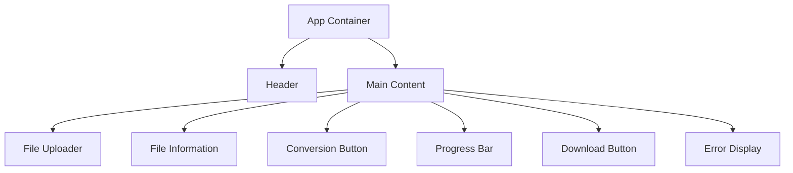
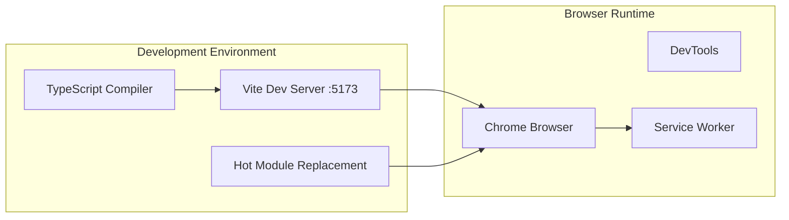

# 動画→MP3変換ウェブアプリケーション設計書

## 1. プロジェクト概要

### 1.1 目的
FFmpeg.wasmを使用して、ブラウザ内で動画ファイルをMP3音声ファイルに変換するシンプルなウェブアプリケーション

### 1.2 主要機能
- 動画ファイルのドラッグ&ドロップまたはファイル選択によるアップロード
- FFmpeg.wasmによる動画からMP3への変換（128kbps固定）
- 変換進捗の表示
- 変換完了後のMP3ファイルダウンロード
- PWA対応によるオフライン動作

### 1.3 制約事項
- Chrome ブラウザのみサポート
- 完全クライアントサイド処理
- 英語インターフェース
- ローカル環境での利用

## 2. 技術スタック概要

### 2.1 選定技術
- npmではなくbunを使用
- **言語**: JavaScript (TypeScript)
    - 理由：型安全性と開発体験の向上
- **フロントエンドフレームワーク**: React 18
  - 理由：コンポーネントベースの開発により保守性が高く、状態管理が容易
- **ビルドツール**: Vite
  - 理由：高速な開発環境、PWA対応が容易、ESモジュール対応
- **スタイリング**: TailwindCSS
  - 理由：ユーティリティファーストでシンプルなUI開発が可能
- **型システム**: TypeScript
  - 理由：型安全性によるバグの削減、開発体験の向上
- **メディア処理**: FFmpeg.wasm
  - 理由：クライアントサイドでの動画処理が可能
- **PWA**: Workbox
  - 理由：Service Worker管理の簡略化、オフライン対応

## 3. UMLによるシステムアーキテクチャ

### 3.1 コンポーネント図



### 3.2 パッケージ構造



## 4. UMLによるデータフロー

### 4.1 アクティビティ図



## 5. UMLクラス図

### 5.1 主要クラス構造



### 5.2 データモデル



## 6. 動的振る舞い

### 6.1 シーケンス図



### 6.2 状態図



### 6.3 ユースケース図



## 7. ウェブサイト構造

### 7.1 サイトマップ

```yaml
pages:
  - path: "/"
    name: "Main Application"
    components:
      - header: "Video to MP3 Converter"
      - file_uploader: "Drag & Drop or Click to Upload"
      - conversion_controls: "Convert Button"
      - progress_display: "Progress Bar"
      - download_section: "Download MP3"
```

### 7.2 ページレイアウト

```
+------------------------------------------+
|            VIDEO TO MP3 CONVERTER        |
+------------------------------------------+
|                                          |
|    +--------------------------------+    |
|    |                                |    |
|    |    DROP VIDEO FILE HERE        |    |
|    |           OR                   |    |
|    |     [CLICK TO BROWSE]          |    |
|    |                                |    |
|    +--------------------------------+    |
|                                          |
|    Selected: [filename.mp4]             |
|                                          |
|         [CONVERT TO MP3]                |
|                                          |
|    Progress: [===========    ] 75%      |
|                                          |
|         [DOWNLOAD MP3]                  |
|                                          |
+------------------------------------------+
```

### 7.3 コンポーネント階層



## 8. インフラストラクチャ構成

### 8.1 ローカル開発環境



### 8.2 PWA構成

```yaml
manifest:
  name: "Video to MP3 Converter"
  short_name: "V2MP3"
  start_url: "/"
  display: "standalone"
  theme_color: "#000000"
  background_color: "#ffffff"
  icons:
    - src: "/icon-192.png"
      sizes: "192x192"
      type: "image/png"
    - src: "/icon-512.png"
      sizes: "512x512"
      type: "image/png"

service_worker:
  caching_strategy:
    - cache_name: "v2mp3-static-v1"
    - files_to_cache:
        - "/"
        - "/index.html"
        - "/manifest.json"
        - "/ffmpeg-core.js"
        - "/ffmpeg-core.wasm"
        - "/ffmpeg-core.worker.js"
```

## 9. 非機能要件への対応

### 9.1 パフォーマンス最適化
- Web Workerでのffmpeg実行による非ブロッキング処理
- ストリーミング処理による大容量ファイル対応
- SharedArrayBufferによる効率的なメモリ共有

### 9.2 エラーハンドリング
```yaml
error_scenarios:
  - type: "UNSUPPORTED_FORMAT"
    message: "The selected file format is not supported. Please select a video file."
    
  - type: "FFMPEG_LOAD_ERROR"
    message: "Failed to load the conversion engine. Please refresh the page."
    
  - type: "CONVERSION_ERROR"
    message: "An error occurred during conversion. Please try again with a different file."
    
  - type: "BROWSER_INCOMPATIBLE"
    message: "This application requires Chrome browser with SharedArrayBuffer support."
    
  - type: "MEMORY_ERROR"
    message: "Insufficient memory to process this file. Try a smaller file."
```

### 9.3 ユーザビリティ
- シンプルな単一画面デザイン
- 直感的なドラッグ&ドロップインターフェース
- リアルタイムの進捗表示
- 明確なエラーメッセージ

## 10. 実装上の注意点

### 10.1 Cross-Origin Isolation
```yaml
headers_required:
  - Cross-Origin-Embedder-Policy: "require-corp"
  - Cross-Origin-Opener-Policy: "same-origin"
reason: "SharedArrayBuffer support for FFmpeg.wasm"
```

### 10.2 メモリ管理
- FFmpeg処理完了後の明示的なメモリ解放
- Blobオブジェクトの適切な破棄
- 大容量ファイル処理時のチャンク処理

### 10.3 Service Worker更新戦略
- キャッシュバージョニングによる更新管理
- skipWaitingによる即時アクティベーション
- 更新通知のUI実装

## 11. 付録

### 11.1 用語集
- **FFmpeg.wasm**: WebAssemblyにコンパイルされたFFmpegライブラリ
- **Service Worker**: オフライン機能を実現するWeb API
- **SharedArrayBuffer**: スレッド間でメモリを共有するためのJavaScript API
- **PWA**: Progressive Web App、ネイティブアプリのような体験を提供するWebアプリ

### 11.2 参考資料
- FFmpeg.wasm公式ドキュメント
- React 18ドキュメント
- Vite PWAプラグインドキュメント
- Chrome SharedArrayBuffer要件

### 12 テスト項目

Playwright MCPを使ったテスト項目

- [ ] `/movies/*` ディレクトリにある音声ファイルをMP3としてダウンロードして、再生できることを確認する
